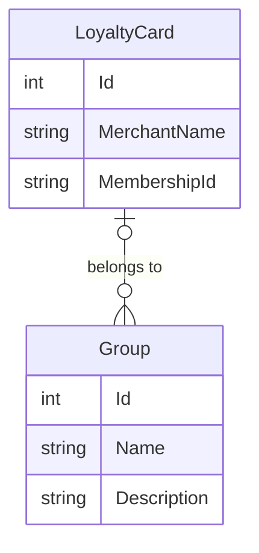

# Présentation

Cette application permet de conserver ses cartes de fidélités et de les organiser à travers des groupes.

# Modèle de données

# Arborescence des fichiers

L'architure mise en place dans ce projet est l'**architecture hexagonale**, à partir de laquelle on en déduit l'arborescence suivante :

- WebApi
    - Controllers
        - LoyaltyCardsController
        - GroupsController
    - Dtos
        - LoyaltyCardGetDtm
        - GroupGetDtm
        - UserGroupsDtm
        - GroupUsersDtm
- Core
    - Contracts
        - Repository
            - IReadRepository
            - IReadWriteRepository
        - Service
            - IUserService
            - IGroupService
    - Entities 
        - UserEntity
        - GroupEntity 
- Infrastructure
    - Repositories
- SharedKernel
    - Services
        - ExportService
            - ToCsv
            - ToXls
- Business
    - Services
        - UserService
        - GroupService
        
