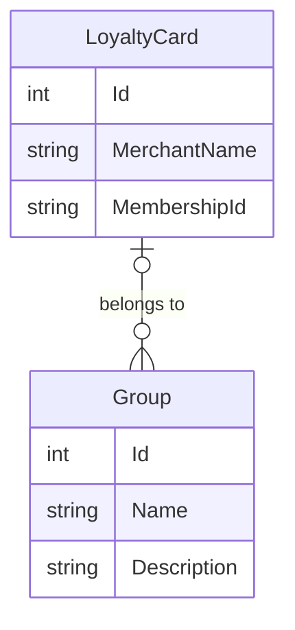

Bienvenue sur ce projet Github personel qui est composé de deux parties :
1. **Code** (vous y êtes déjà) : contient un code d'applicatifs permettant de gèrer des cartes de fidélité ou d'abonnement.
2. **Wiki** : contient un ensemble d'articles traitant du développement logiciel et de l'administration système, principalement sous environnement Microsoft.

Ce code est à but pédagogique et experimental. Il permet de montrer et d'expliquer différentes implémentations de fonctionnalités et de patrons de conception.

# Fonctionnalités
* Consultation et gestion des cartes de fidélité
* Export des données au format CSV, Excel et PDF
* Import des données au format CSV et Excel

# Applications
* WebAPI: Expose les données via une API REST
* MVC: Site web permettant de consuter et manipuler les données
* Console: Gestion des données en local ou via une WebAPI

# Modèle de données
